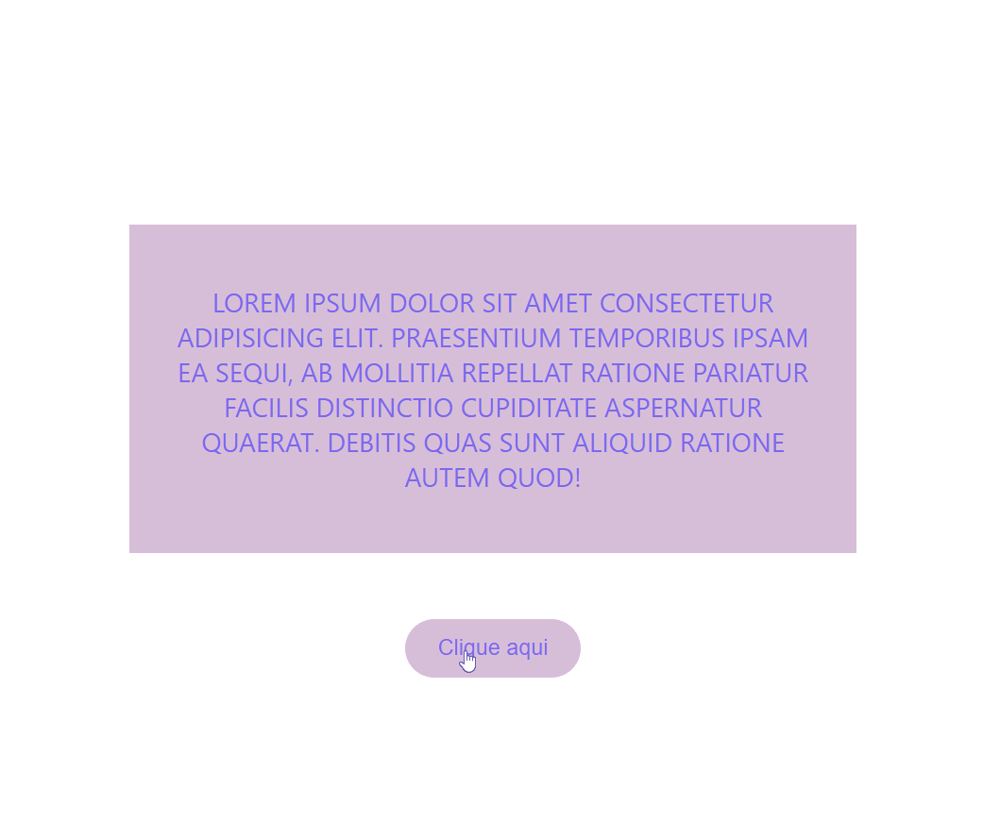

# Desafio React Base

Esse desafio foi proposto durante as aulas do curso DevQuest com o objetivo de praticar o React.
________________________________________________

### As solicitações feitas como desafio foram:

- Renderizar na tela um parágrafo colorido
e com todas as letras maiúsculas usando JS;

- Utilizar props para passar o texto e a cor de texto desejada
para dentro do componente;

- Criar um componente Button com um evento de clique que
apresente um alerta informando a prop label do botão que
foi clicado, com a seguinte mensagem: "A label desse botão é + label".
________________________________________________

### Captura de tela

__________________________________________________

### Links

- [Solução]()
- [GitHub Pages]()
__________________________________________________

### Construído com

- HTML5
- CSS
- JavaScript
- React
__________________________________________________

### Autora

- Portfólio - [Flávia Figueredo](https://flaviafigueredo.github.io/mini-portfolio/)
- GitHub - [@flaviafigueredo](https://github.com/flaviafigueredo)